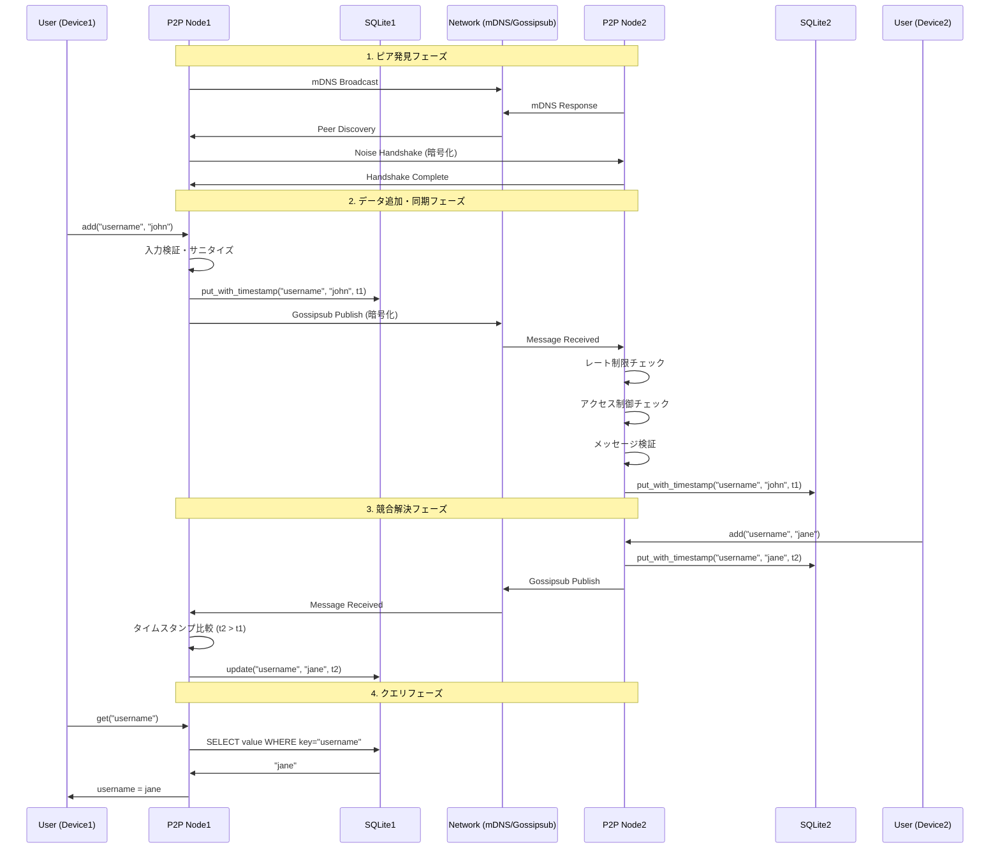

# P2P Sync System

分散型キーバリューストア - 自動起動対応のP2P同期システム

## 概要

P2P Sync Systemは、複数のデバイス間でデータを自動的に同期する分散型キーバリューストアです。中央サーバーを必要とせず、ピアツーピア（P2P）ネットワークを使用してデータの一貫性を保ちます。

### このツールでできること

- **分散データ保存**: キーバリューペアを複数のデバイスに分散保存
- **自動同期**: ネットワーク上のピア間でデータを自動的に同期
- **オフライン対応**: ネットワークが切断されても、再接続時に自動的に同期
- **設定共有**: アプリケーション設定やユーザーデータの共有
- **バックアップ**: 重要なデータの分散バックアップ
- **プライベートネットワーク**: 企業内や家庭内での安全なデータ共有

### 使用例

- **開発環境の設定同期**: 複数のマシン間で開発環境設定を共有
- **小規模チームでのデータ共有**: パスワード、APIキーなどの機密情報の共有
- **IoTデバイス間の状態同期**: センサーデータや設定の同期
- **分散型ノート**: 複数デバイス間でのメモやドキュメントの同期
- **ゲームの進行状況**: マルチプレイヤーゲームの状態管理

## 機能

- **P2P通信**: libp2pを使用した分散型ネットワーク
- **キーバリューストア**: 分散型のデータ同期
- **自動起動**: システム起動時に自動的にサービスを開始
- **マルチプラットフォーム**: Linux、macOS、Windowsに対応
- **セキュリティ強化**: レート制限、アクセス制御、入力検証
- **🆕 信頼チェーンシステム**: ピア推薦による簡易信頼関係構築
- **自動鍵配布**: ピア間での公開鍵の自動交換
- **ホワイトリスト管理**: 信頼できるピアのみとの通信

## セットアップ

### 方法1: ビルド済みバイナリを使用（推奨）

```bash
# ビルド済みバイナリをシステムにインストール
sudo cp target/release/p2p-sync /usr/local/bin/

# 実行権限を確認
sudo chmod +x /usr/local/bin/p2p-sync

# 実行
p2p-sync start

# 自動起動サービスのインストール
p2p-sync install
```

### 方法2: GitHubリリースからダウンロード

```bash
# 最新リリースをダウンロード（例: Linux x86_64）
wget https://github.com/yourusername/p2p-sync/releases/latest/download/p2p-sync-linux-x86_64
sudo mv p2p-sync-linux-x86_64 /usr/local/bin/p2p-sync
sudo chmod +x /usr/local/bin/p2p-sync
```

### 方法3: cargoを使用（開発者向け）

```bash
# ビルド
cargo build --release

# 実行
cargo run --release -- start

# 自動起動サービスのインストール
cargo run --release -- install
```

## 使い方

### CLIコマンド

```bash
# P2Pノードを起動
p2p-sync start [OPTIONS]

# オプション:
#   -p, --port <PORT>           リッスンポート (デフォルト: 0 = 自動)
#   -d, --dial <MULTIADDR>      接続先のピアアドレス
#   --data-dir <PATH>           データ保存ディレクトリ

# 自動起動サービスをインストール
p2p-sync install
```

### 対話的コマンド（起動後）

#### データ操作
- `add <key> <value>`: キーバリューペアを追加・同期
- `get <key>`: 値を取得
- `list`: 全てのキーバリューペアを表示

#### 鍵管理・信頼関係
- `announce-key`: 自分の公開鍵をネットワークに通知
- `request-keys`: 欠落している公開鍵を要求
- `request-whitelist`: ホワイトリストへの追加を要求
- `recommend-peer <peer_id>`: ピアを推薦（信頼チェーン機能）

#### システム管理
- `cleanup`: 古いデータをクリーンアップ
- `reload-cache`: キャッシュを再読み込み
- `verify-signature`: 署名検証機能の情報表示
- `test-access-control`: アクセス制御のテスト

### 実際の使用例

```bash
# ターミナル1（デバイス1）
$ p2p-sync start
Local peer id: 12D3KooWAbC...
Local node is listening on /ip4/192.168.1.100/tcp/4001
> add username john_doe
Published: username = john_doe

# ターミナル2（デバイス2、同じネットワーク内）
$ p2p-sync start
Local peer id: 12D3KooWXyZ...
mDNS discovered a new peer: 12D3KooWAbC...
Got message from 12D3KooWAbC...: Put { key: "username", value: "john_doe", timestamp: 2024-01-01T12:00:00Z }

> get username
username = john_doe

> add api_key secret123
Published: api_key = secret123

# デバイス1でも自動的に同期される
Got message from 12D3KooWXyZ...: Put { key: "api_key", value: "secret123", timestamp: 2024-01-01T12:01:00Z }
```

### 自動起動の設定

`install` コマンドでOS固有の自動起動メカニズムを設定：

- **Linux**: systemdサービスとして登録
- **macOS**: LaunchAgentとして登録  
- **Windows**: スタートアップフォルダにショートカット作成

## プロジェクト構造

```
src/
├── main.rs         # CLIエントリーポイント
├── autostart.rs    # OS別の自動起動実装
├── config.rs       # 設定管理
├── network.rs      # libp2pネットワーク動作
├── security.rs     # セキュリティ機能
├── storage.rs      # SQLiteベースのストレージ
└── sync.rs         # 同期メッセージ定義
```

## アーキテクチャ

### データ同期の仕組み



#### シーケンス説明

1. **ピア発見**: mDNSでローカルネットワーク内のピアを自動発見
2. **暗号化通信**: NoiseプロトコルでE2E暗号化された通信
3. **メッセージ配信**: Gossipsubプロトコルで全ピアにデータ配信
4. **競合解決**: タイムスタンプベースの最終書き込み優先（LWW）
5. **永続化**: SQLiteによるローカルストレージへの保存

### 技術スタック

- **ネットワーク層**: libp2pによるP2P通信
  - Gossipsubプロトコルでメッセージ配信
  - mDNSでローカルピア発見
  - Kademliaで分散ハッシュテーブル
  - TCPとQUICトランスポート対応
- **ストレージ層**: SQLiteでローカルデータ管理
  - タイムスタンプベースの競合解決
  - 最終書き込み優先（LWW）方式
- **自動起動層**: OS固有の起動メカニズム
- **セキュリティ層**: レート制限、入力検証、アクセス制御

## セキュリティ機能

### レート制限

- 1分間あたりのリクエスト数制限（デフォルト: 60回）
- バースト制限（デフォルト: 10回/秒）

### アクセス制御

- ピアのブロックリスト/許可リスト
- IP単位の接続数制限

### 入力検証

- キー/値のサイズ制限
- 制御文字やパストラバーサル攻撃の防止
- メッセージサイズ制限（デフォルト: 1MB）

### 設定ファイル（config.toml）

```toml
port = 4001
data_dir = "/path/to/data"
bootstrap_peers = []

[security]
rate_limit_per_minute = 60
rate_limit_burst = 10
max_message_size = 1048576
max_key_length = 256
max_value_length = 65536
max_connections_per_ip = 10
blocked_peers = []
# allowed_peers = ["12D3KooW..."] # オプション
```

## 依存関係

主要な依存関係:

- `libp2p`: P2P通信フレームワーク
- `tokio`: 非同期ランタイム
- `rusqlite`: SQLiteバインディング
- `clap`: CLIパーサー
- `tracing`: ロギング

## リリース・ダウンロード

### GitHub Releases
最新のビルド済みバイナリは[Releases](https://github.com/osamusic/p2p-sync/releases)からダウンロードできます：

- **Linux**: `p2p-sync-v*.*.*-linux-x86_64.tar.gz` / `p2p-sync-v*.*.*-linux-aarch64.tar.gz`
- **macOS**: `p2p-sync-v*.*.*-macos-x86_64.tar.gz` / `p2p-sync-v*.*.*-macos-aarch64.tar.gz`  
- **Windows**: `p2p-sync-v*.*.*-windows-x86_64.zip`

### Docker Images
```bash
# 最新版を実行
docker run --rm -p 4001:4001 ghcr.io/osamusic/p2p-sync:latest

# 特定のバージョンを実行
docker run --rm -p 4001:4001 ghcr.io/osamusic/p2p-sync:v0.2.0
```

### セキュリティ
- すべてのリリースバイナリにSHA256チェックサム付き
- Docker イメージは マルチアーキテクチャ対応 (amd64/arm64)

## 詳細ドキュメント

### 技術ドキュメント
- [ネットワークアーキテクチャ](docs/NETWORK_ARCHITECTURE.md) - P2Pネットワークの完全な技術仕様
- [ピア発見シーケンス](docs/PEER_DISCOVERY_SEQUENCE.md) - 詳細なシーケンス図とP2P動作原理
- [インストールガイド](docs/INSTALL.md) - プラットフォーム別の詳細インストール手順
- [リリースガイド](docs/RELEASE.md) - リリースプロセスとパッケージ作成

### セキュリティ・機能ドキュメント
- [ホワイトリストと署名システム](docs/WHITELIST_AND_SIGNING.md) - 認証とアクセス制御の詳細
- [自動鍵配布システム](docs/KEY_DISTRIBUTION.md) - ピア間鍵交換と信頼チェーン機能

### ネットワーク動作原理

P2P Syncは**ポート転送なし**でローカルネットワーク内で動作します：

- **mDNS自動発見**: マルチキャストDNSによる自動ピア発見
- **LAN内直接通信**: プライベートIP同士の直接接続
- **libp2pプロトコルスタック**: 自動化されたネットワークプロトコル処理
- **Gossipsubメッシュ**: 効率的なメッセージブロードキャスト

```
┌─────────────┐    ┌─────────────┐    ┌─────────────┐
│   Node A    │    │   Node B    │    │   Node C    │
│192.168.1.100│◄──►│192.168.1.101│◄──►│192.168.1.102│
│   :4001     │    │   :4002     │    │   :4003     │
└─────────────┘    └─────────────┘    └─────────────┘
       ▲                  ▲                  ▲
       └────── mDNS自動発見 ──────────────────┘
              （ポート転送不要）
```

完全な技術詳細は[ネットワークアーキテクチャ](docs/NETWORK_ARCHITECTURE.md)を参照してください。

## ライセンス

このプロジェクトは、GNU Affero General Public License v3.0 (AGPL-3.0) に追加条項を加えたライセンスで提供されています。詳細は[LICENSE](LICENSE)ファイルを参照してください。

### 重要なライセンス条項:
- **不正な利用の禁止**: 違法行為、悪意のある目的、プライバシー侵害などでの使用は厳格に禁止されています
- **ソースコード開示義務**: このソフトウェアを使用したネットワークサービスは、利用者にソースコードへのアクセスを提供する必要があります
- **改変版の明示**: 改変版は変更されたことを明示する必要があります
- 完全な条項と制限についてはLICENSEファイルを参照してください
