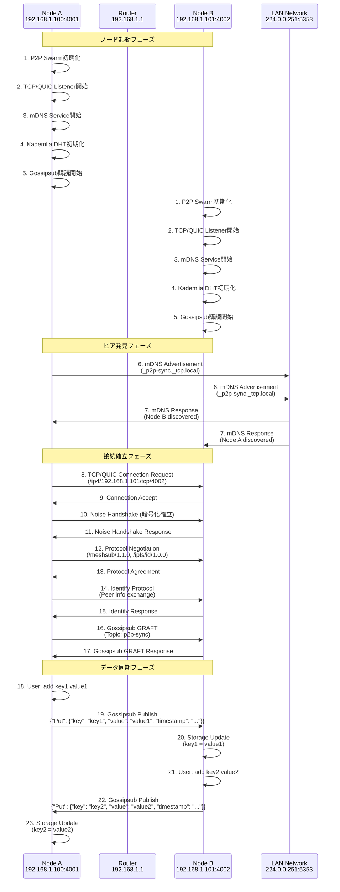
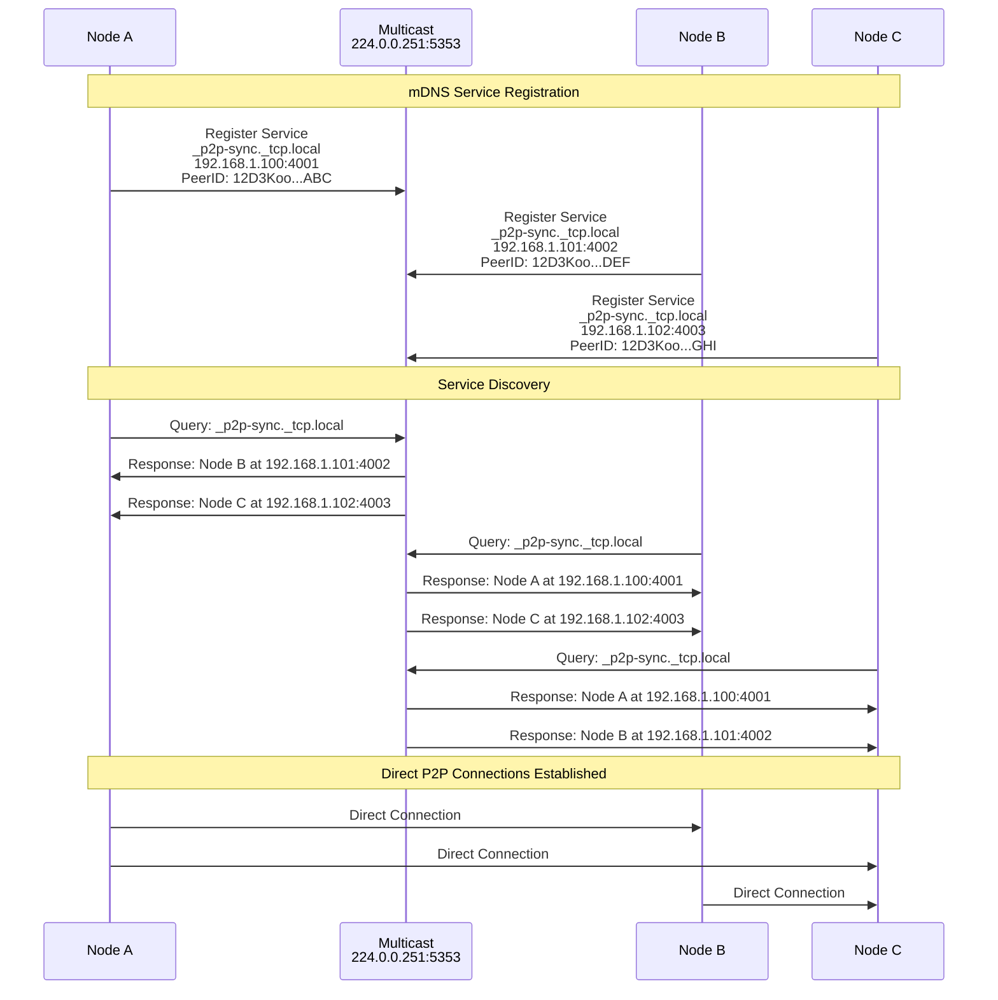
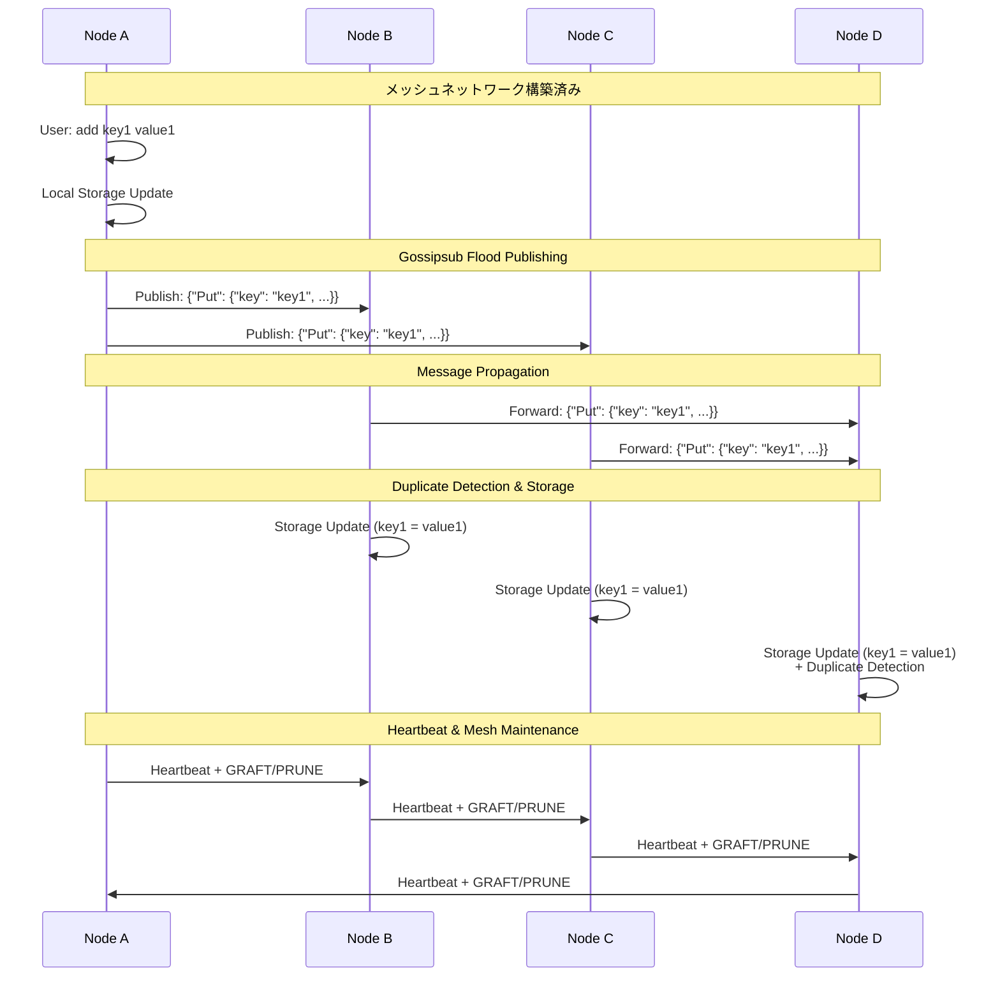
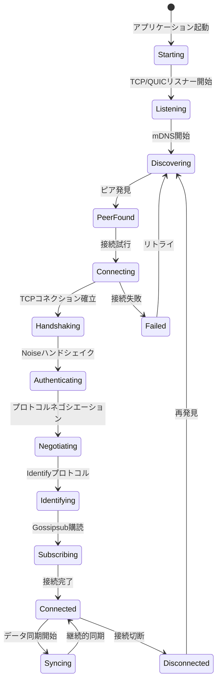
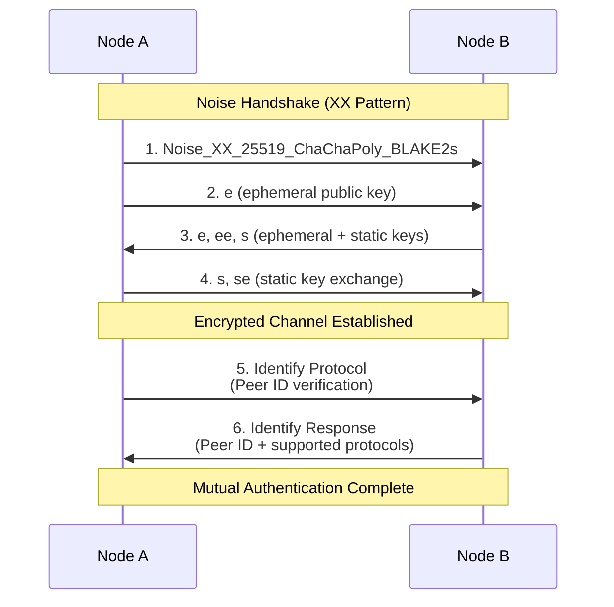

# P2P Sync ネットワークアーキテクチャ

## 概要

P2P Syncは、中央サーバーを必要としない分散型同期システムです。libp2pを使用して、複数のプロトコルを組み合わせた堅牢なP2Pネットワークを構築しています。

## アーキテクチャ図

```
┌─────────────────┐    ┌─────────────────┐    ┌─────────────────┐
│   Node A        │    │   Node B        │    │   Node C        │
│ 192.168.1.100   │    │ 192.168.1.101   │    │ 192.168.1.102   │
│ Port: 4001      │    │ Port: 4002      │    │ Port: 4003      │
└─────────────────┘    └─────────────────┘    └─────────────────┘
         │                       │                       │
         └───────── LAN ──────────┼───────────────────────┘
                    │
              ┌─────────────┐
              │   Router    │
              │ 192.168.1.1 │
              └─────────────┘
```

## プロトコルスタック

```
┌─────────────────────────────────────────┐
│           Application Layer             │
│        (Key-Value Sync Logic)          │
├─────────────────────────────────────────┤
│            Gossipsub                    │
│        (Message Broadcasting)          │
├─────────────────────────────────────────┤
│              libp2p                     │
│   ┌─────────┬─────────┬─────────────┐   │
│   │  mDNS   │   DHT   │  Identify   │   │
│   │(Discover│(Kademlia│ (Protocol   │   │
│   │   y)    │)        │   Info)     │   │
│   └─────────┴─────────┴─────────────┘   │
├─────────────────────────────────────────┤
│         Transport Layer                 │
│     ┌─────────────┬─────────────────┐   │
│     │    TCP      │      QUIC       │   │
│     │             │   (over UDP)    │   │
│     └─────────────┴─────────────────┘   │
├─────────────────────────────────────────┤
│         Security Layer                  │
│              Noise                      │
│        (Encryption + Auth)              │
└─────────────────────────────────────────┘
```

## ノード起動とピア発見のシーケンス



## mDNSによる自動発見の詳細



## Gossipsubメッセージ配信



## 接続確立の状態遷移



## ネットワークトポロジーの種類

### 1. 同一LANでの接続

```
┌─────────────────────────────────────────────────────────────┐
│                    LAN (192.168.1.0/24)                    │
│                                                             │
│  ┌──────────┐    ┌──────────┐    ┌──────────┐              │
│  │ Node A   │    │ Node B   │    │ Node C   │              │
│  │.100:4001 │◄──►│.101:4002 │◄──►│.102:4003 │              │
│  └──────────┘    └──────────┘    └──────────┘              │
│                                                             │
└─────────────────────────────────────────────────────────────┘

特徴:
✓ ポート転送不要
✓ mDNS自動発見
✓ 高速・低遅延
✓ ファイアウォール設定不要
```

### 2. インターネット越しの接続

```
┌─────────────────┐    ┌─────────────────┐    ┌─────────────────┐
│   LAN A         │    │   Internet      │    │   LAN B         │
│                 │    │                 │    │                 │
│ ┌─────────────┐ │    │                 │    │ ┌─────────────┐ │
│ │   Node A    │ │    │                 │    │ │   Node B    │ │
│ │ 192.168.1.2 │◄┼────┼─────────────────┼────┼►│ 10.0.0.100  │ │
│ └─────────────┘ │    │                 │    │ └─────────────┘ │
│      │          │    │                 │    │      │          │
│ ┌─────────────┐ │    │                 │    │ ┌─────────────┐ │
│ │Router/NAT   │ │    │                 │    │ │Router/NAT   │ │
│ │1.2.3.4:4001 │ │    │                 │    │ │5.6.7.8:4002 │ │
│ └─────────────┘ │    │                 │    │ └─────────────┘ │
└─────────────────┘    └─────────────────┘    └─────────────────┘

必要な設定:
- ポート転送 (4001 → Node A)
- 外部IP指定での接続
- ファイアウォール開放
- 手動ピア指定
```

### 3. ハイブリッド接続

```
┌─────────────────────────────────────────────────────────────┐
│                    LAN (192.168.1.0/24)                    │
│                                                             │
│  ┌──────────┐    ┌──────────┐                              │
│  │ Node A   │◄──►│ Node B   │                              │
│  │.100:4001 │    │.101:4002 │                              │
│  └──────────┘    └──────────┘                              │
│       │               │                                     │
└───────┼───────────────┼─────────────────────────────────────┘
        │               │
        └───────────────┼─────── Internet ──────┐
                        │                       │
                   ┌──────────┐         ┌──────────┐
                   │ Node C   │         │ Node D   │  
                   │External  │◄───────►│External  │
                   │5.6.7.8   │         │9.10.11.12│
                   └──────────┘         └──────────┘

特徴:
- LANノード同士: mDNS自動発見
- 外部ノード: 手動接続 + DHT経由発見
- 混在環境での柔軟な接続
```

## セキュリティモデル

### 1. 暗号化レイヤー

```
Application Data
        ↓
   Gossipsub Layer (メッセージ署名)
        ↓
    Noise Protocol (AES-256-GCM)
        ↓
     TCP/QUIC Transport
        ↓
    Network (IP/Ethernet)
```

### 2. 認証フロー



## パフォーマンス特性

### 接続確立時間

| フェーズ | 典型的時間 | 説明 |
|----------|------------|------|
| mDNS発見 | 100-500ms | ローカルネットワーク内での発見 |
| TCP接続 | 1-10ms | 同一LAN内での接続確立 |
| Noiseハンドシェイク | 5-20ms | 暗号化チャネル確立 |
| プロトコルネゴシエーション | 10-50ms | libp2pプロトコル合意 |
| 総接続時間 | 116-580ms | 完全な接続確立まで |

### メッセージ伝播

| ノード数 | 平均伝播時間 | 最大ホップ数 |
|----------|--------------|--------------|
| 2-5 | < 10ms | 1 |
| 6-20 | 10-50ms | 2-3 |
| 21-100 | 50-200ms | 3-4 |

## トラブルシューティング

### よくある問題と解決策

1. **mDNS発見が動作しない**
   - ファイアウォールでマルチキャスト（UDP 5353）がブロックされている
   - 異なるVLANに配置されている
   - mDNSサービスが無効になっている

2. **接続確立後すぐに切断される**
   - Noiseハンドシェイクの失敗
   - プロトコルバージョンの不一致
   - ネットワーク不安定

3. **メッセージが同期されない**
   - Gossipsubトピックの不一致
   - メッセージサイズ制限超過
   - 暗号化/復号化エラー

### デバッグコマンド

```bash
# 詳細ログでの起動
RUST_LOG=debug ./p2p-sync start --port 4001

# 接続状況確認
> status
> peers
> info

# ネットワーク診断
./debug-network.sh
```

## 将来の拡張

### 計画中の機能

1. **NAT Traversal強化**
   - STUN/TURNサーバー対応
   - UPnPによる自動ポート転送
   - WebRTC接続サポート

2. **DHT機能拡充**
   - コンテンツベースのルーティング
   - 分散ストレージ機能
   - レプリケーション制御

3. **セキュリティ強化**
   - 証明書ベース認証
   - 権限管理システム
   - 監査ログ機能

---

このドキュメントは、P2P Syncのネットワークアーキテクチャの完全な理解を提供します。実装の詳細や設定方法については、各々の技術ドキュメントを参照してください。