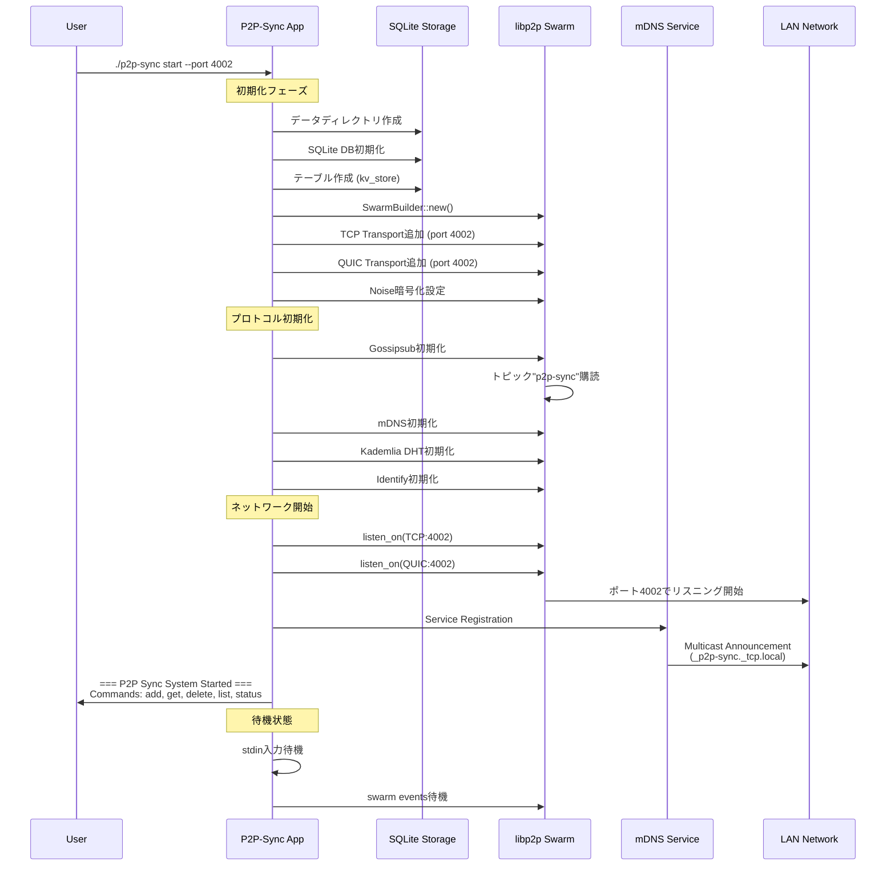
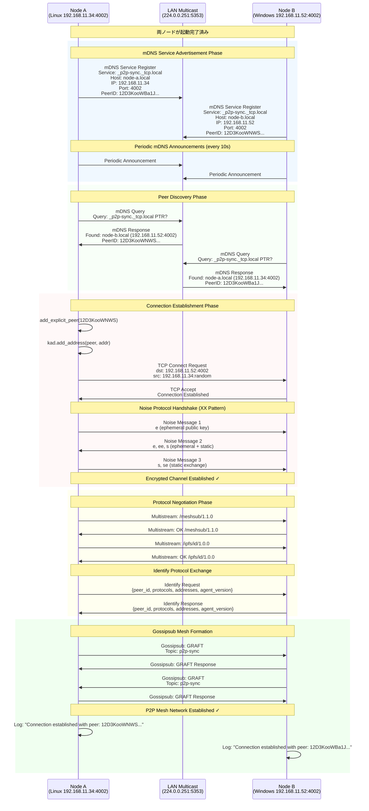
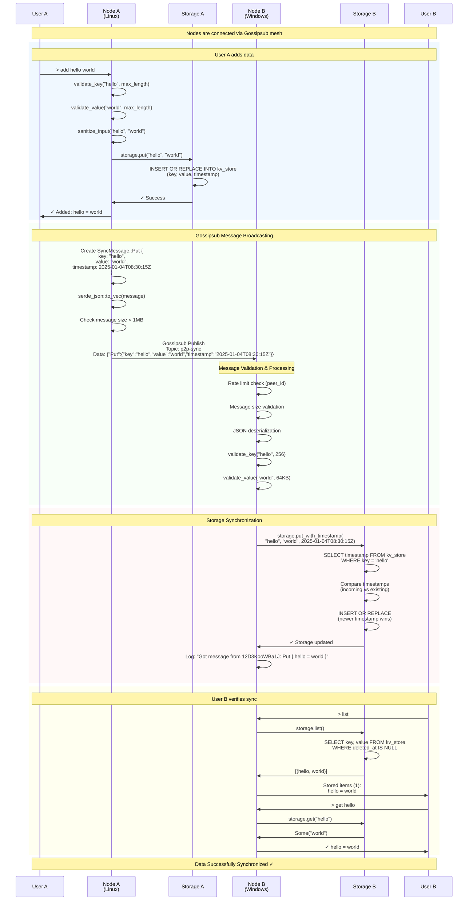
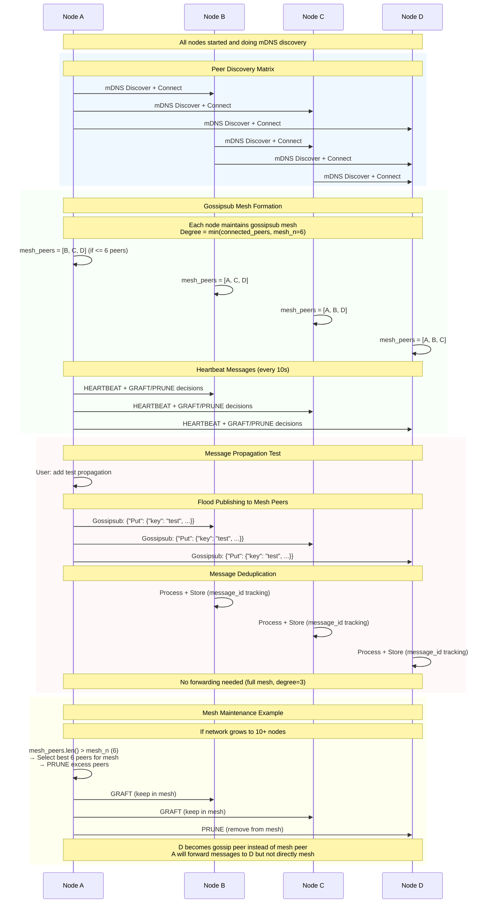
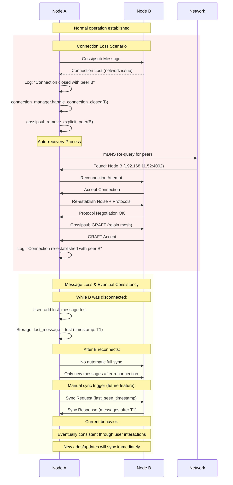
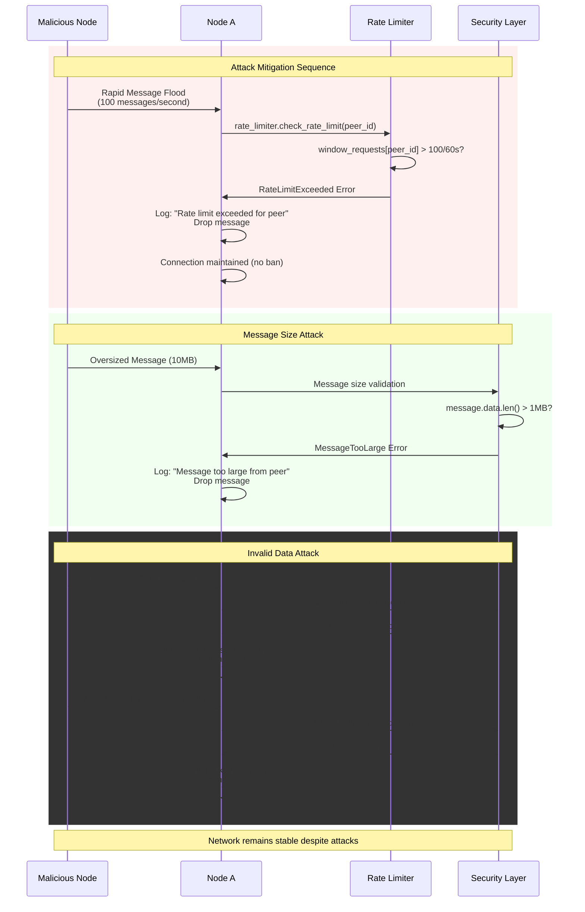

# P2Pピア発見とデータ同期シーケンス詳細

## 1. 完全なノード起動シーケンス



## 2. 2ノード間でのピア発見詳細シーケンス



## 3. データ同期の詳細シーケンス



## 4. 3ノード以上でのメッシュネットワーク形成



## 5. エラーハンドリングとリカバリ



## 6. セキュリティバリデーション詳細



## まとめ

このシーケンス図は、P2P Syncが**なぜポート転送なしで動作するか**を明確に示しています：

### 🔑 **キーポイント**

1. **同一LAN内通信** - プライベートIP同士の直接通信
2. **mDNS自動発見** - マルチキャスト（224.0.0.251:5353）による自動ピア発見  
3. **双方向リスニング** - 全ノードがTCP/QUICでリスニング
4. **libp2pの抽象化** - 複雑なネットワーク処理の自動化
5. **堅牢なエラー処理** - 接続断絶からの自動回復

### 📊 **プロトコルスタック**
```
User Commands (add/get/list/status)
        ↓
Application Logic (validation, storage)
        ↓  
Gossipsub (message broadcasting)
        ↓
libp2p (peer management, protocols)
        ↓
Noise (encryption + authentication)  
        ↓
TCP/QUIC (reliable transport)
        ↓
IP (network routing)
```

この詳細なシーケンス図により、P2P Syncの動作原理を完全に理解できます。ポート転送が不要な理由と、分散システムとしての堅牢性を実現する仕組みが明確になります。