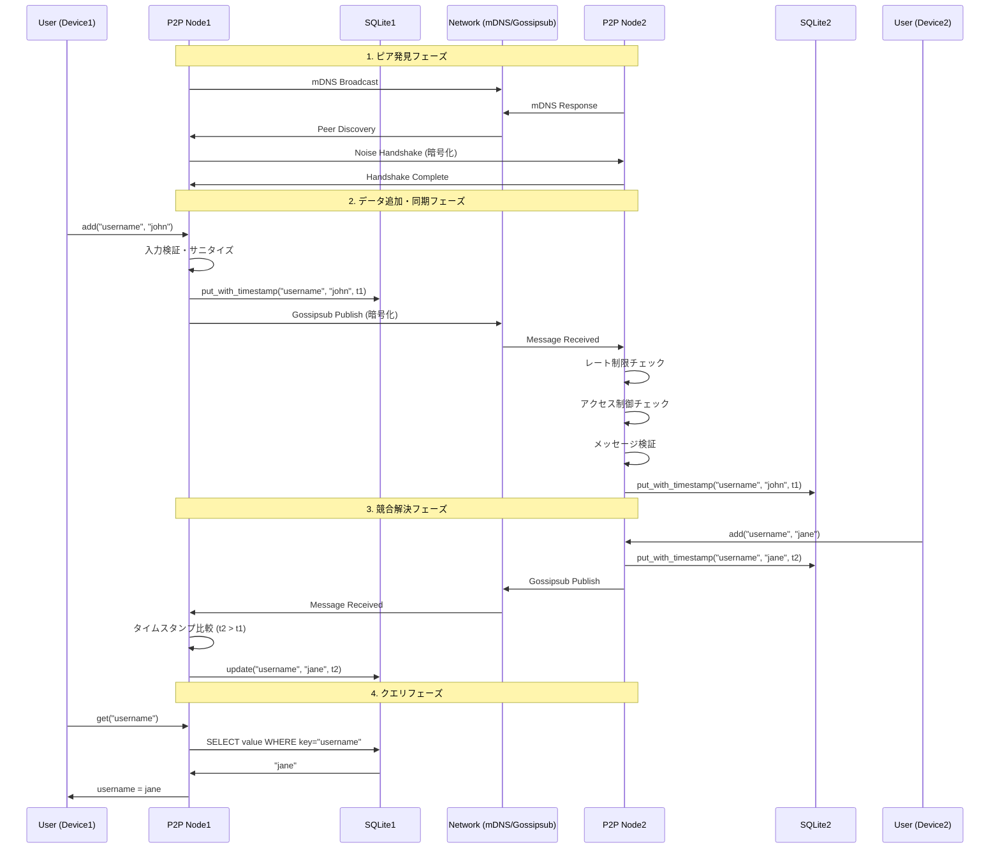
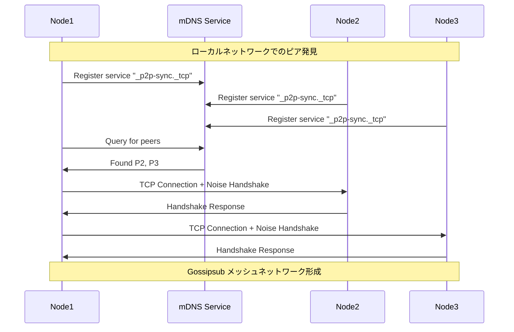
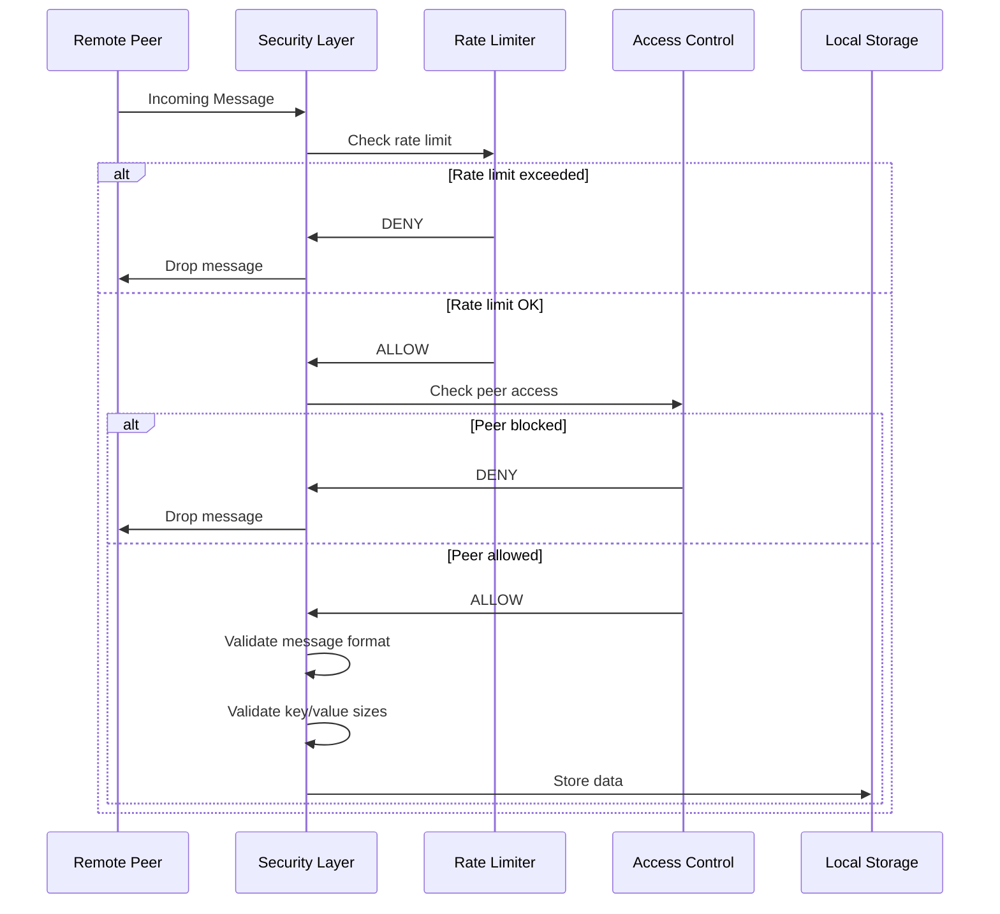
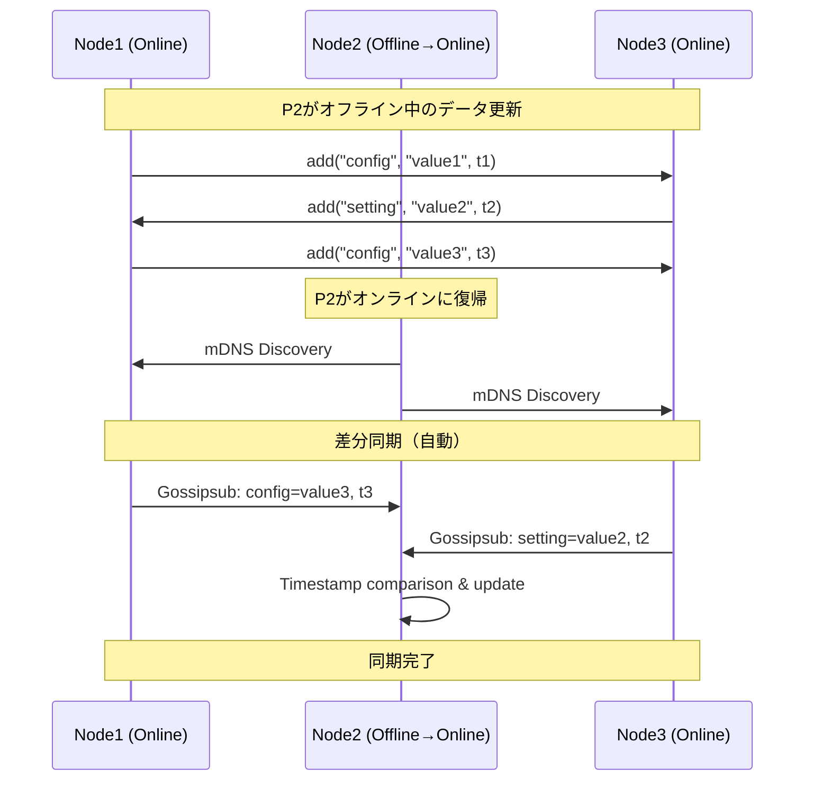

# P2P Sync System - シーケンス図

## 全体のデータ同期フロー

```mermaid
sequenceDiagram
    participant U1 as User (Device1)
    participant P1 as P2P Node1
    participant DB1 as SQLite1
    participant N as Network (mDNS/Gossipsub)
    participant P2 as P2P Node2
    participant DB2 as SQLite2
    participant U2 as User (Device2)

    Note over P1,P2: 1. ピア発見フェーズ
    P1->>N: mDNS Broadcast
    P2->>N: mDNS Response
    N->>P1: Peer Discovery
    P1->>P2: Noise Handshake (暗号化)
    P2->>P1: Handshake Complete

    Note over P1,P2: 2. データ追加・同期フェーズ
    U1->>P1: add("username", "john")
    P1->>P1: 入力検証・サニタイズ
    P1->>DB1: put_with_timestamp("username", "john", t1)
    P1->>N: Gossipsub Publish (暗号化)
    N->>P2: Message Received
    P2->>P2: レート制限チェック
    P2->>P2: アクセス制御チェック
    P2->>P2: メッセージ検証
    P2->>DB2: put_with_timestamp("username", "john", t1)

    Note over P1,P2: 3. 競合解決フェーズ
    U2->>P2: add("username", "jane")
    P2->>DB2: put_with_timestamp("username", "jane", t2)
    P2->>N: Gossipsub Publish
    N->>P1: Message Received
    P1->>P1: タイムスタンプ比較 (t2 > t1)
    P1->>DB1: update("username", "jane", t2)

    Note over P1,P2: 4. クエリフェーズ
    U1->>P1: get("username")
    P1->>DB1: SELECT value WHERE key="username"
    DB1->>P1: "jane"
    P1->>U1: username = jane
```

## ピア発見プロセス

```mermaid
sequenceDiagram
    participant P1 as Node1
    participant mDNS as mDNS Service
    participant P2 as Node2
    participant P3 as Node3

    Note over P1,P3: ローカルネットワークでのピア発見
    
    P1->>mDNS: Register service "_p2p-sync._tcp"
    P2->>mDNS: Register service "_p2p-sync._tcp"
    P3->>mDNS: Register service "_p2p-sync._tcp"
    
    P1->>mDNS: Query for peers
    mDNS->>P1: Found P2, P3
    
    P1->>P2: TCP Connection + Noise Handshake
    P2->>P1: Handshake Response
    
    P1->>P3: TCP Connection + Noise Handshake
    P3->>P1: Handshake Response
    
    Note over P1,P3: Gossipsub メッシュネットワーク形成
```

## セキュリティチェックフロー

```mermaid
sequenceDiagram
    participant Peer as Remote Peer
    participant Security as Security Layer
    participant RateLimit as Rate Limiter
    participant AccessCtrl as Access Control
    participant Storage as Local Storage

    Peer->>Security: Incoming Message
    Security->>RateLimit: Check rate limit
    
    alt Rate limit exceeded
        RateLimit->>Security: DENY
        Security->>Peer: Drop message
    else Rate limit OK
        RateLimit->>Security: ALLOW
        Security->>AccessCtrl: Check peer access
        
        alt Peer blocked
            AccessCtrl->>Security: DENY
            Security->>Peer: Drop message
        else Peer allowed
            AccessCtrl->>Security: ALLOW
            Security->>Security: Validate message format
            Security->>Security: Validate key/value sizes
            Security->>Storage: Store data
        end
    end
```

## オフライン復帰シナリオ

```mermaid
sequenceDiagram
    participant P1 as Node1 (Online)
    participant P2 as Node2 (Offline→Online)
    participant P3 as Node3 (Online)

    Note over P1,P3: P2がオフライン中のデータ更新
    
    P1->>P3: add("config", "value1", t1)
    P3->>P1: add("setting", "value2", t2)
    P1->>P3: add("config", "value3", t3)
    
    Note over P2: P2がオンラインに復帰
    
    P2->>P1: mDNS Discovery
    P2->>P3: mDNS Discovery
    
    Note over P1,P3: 差分同期（自動）
    
    P1->>P2: Gossipsub: config=value3, t3
    P3->>P2: Gossipsub: setting=value2, t2
    
    P2->>P2: Timestamp comparison & update
    
    Note over P1,P3: 同期完了
```